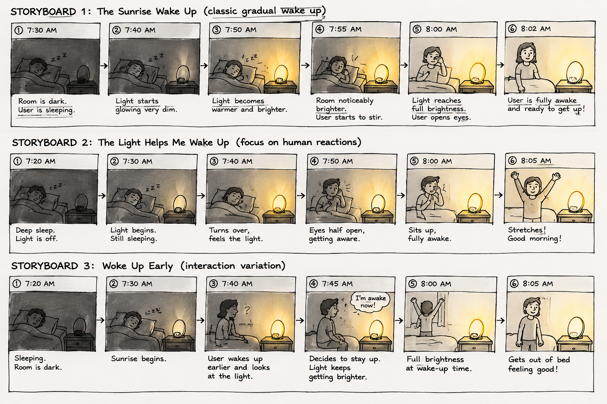

# Recreating the Masters of Interactive Light

_This project is to be done in teams of 2._

**Jerry Lee**
**Yuqi Wang**

**THE MASTERWORK YOU DREW FROM THE HAT:**
Philips Wake-Up Light (A lamp that simulates dawn to wake you gently before the alarm).

---

One way to understand greatness is to look to the greats. Just as painters learn
the technique and artistry of the old masters by recreating their paintings, so
too shall we come to understand computer-mediated interaction by recreating the
interactive masterworks of our time.

This week, every team will draw a different masterwork from a hat. Some are
conceptual pieces, some are historical works, some are modern-day products —
but they all share one thing: **their central mode of interaction is carried by
light.** Think of Tinker Bell in the original stage production of *Peter Pan*,
represented by nothing more than a darting circle of light from an off-stage
mirror. There was no actor playing Tinker Bell; she existed entirely through the
way the other characters interacted with that light.

Your job is to recreate the *interaction* of the piece you drew — not to build a
museum-grade replica, but to stage the moment that makes it what it is. Someone
who knows your piece should watch your recreation and recognize it instantly.
Someone who has never heard of it should walk away understanding what it is
famous for.

You will do this using the interaction staging techniques we will use all semester: a
storyboard, some acting, a phone standing in as a controllable light (the
*Tinkerbelle* tool), a hidden human "wizard" driving it, a costume, and a
recorded video.

*Make sure you read all the instructions and understand the whole activity
before starting!*

## Prep

To start, you will need:

1. Read about Git [here](https://git-scm.com/book/en/v2/Getting-Started-What-is-Git%3F).
2. Set up your own Github "Lab Hub" by forking the [Interactive-Lab-Hub repository](https://github.com/IRL-CT/Interactive-Lab-Hub). To get lab updates, simply use [GitHub's "Sync fork" button](https://docs.github.com/en/pull-requests/collaborating-with-pull-requests/working-with-forks/syncing-a-fork) when new content is available.

3. Set up your `README.md` so it has your name and links to this lab. Learn to
   format a README [here](https://docs.github.com/en/get-started/writing-on-github/getting-started-with-writing-and-formatting-on-github/basic-writing-and-formatting-syntax).
4. **Draw your masterwork from the hat and write it at the top of this file.**
   Whatever you drew is yours — lean into it.

## Materials

For this lab you will need:

1. Paper, markers/pens, scissors
2. A smartphone with a browser that can display a webpage (your stand-in "light")
3. A computer to host the control webpage
4. Found objects and materials to **costume your phone so it looks like the
   device in your masterwork** — doll clothes, a paper lantern, a bottle, foil,
   a cardboard shell, whatever it takes. Be resourceful.

## Deliverables

Submit all of the following in this lab folder of your Lab Hub, as links or
uploaded files. **Each group member posts their own copy to their own Github repo**, even if the work is
shared.

1. A short **research write-up** of your masterwork (what it is, when, who made
   it, and — most importantly — what the interaction is)
2. **3 iterated storyboards** of the interaction in the masterwork
5. A **video sketch** of your prototyped interaction
6. Any **reflections** on the process

Labs are due on Mondays. Make sure this page is linked from your main class hub
page.

---

# The Report

## Part 0. Know Your Master

The Philips Wake-Up Light is an alarm clock designed to make waking up feel more natural. Instead of suddenly waking the user with a loud alarm, it slowly increases the brightness of the light before the set wake-up time, similar to a sunrise. The main input from the user is setting the wake-up time, and depending on the model, the user can also adjust things like brightness and alarm sound. The main response from the device is the gradual change in light, followed by sound at the wake-up time.

The interaction mostly happens between one person and the light in a bedroom. What I find interesting is that the user does not really need to actively interact with the device while it is working. They are usually asleep. The light changes the environment around them first, and the person gradually responds by becoming more awake. This makes the interaction feel less like a normal alarm and more like the device is changing the room around the user.

The Wake-Up Light is mainly known for simulating a sunrise. Its biggest strength is that the change happens gradually instead of all at once, which can make waking up feel less abrupt. One weakness is that the experience depends a lot on the environment and the person. For example, if the room is already bright or the user is a very heavy sleeper, the light may not be enough by itself.

The core interaction I would recognize is very simple: a person is sleeping in a dark room, the light slowly becomes brighter as the wake-up time gets closer, and the person gradually wakes up. The gradual transition from darkness to light, rather than just turning the light on, is what makes the Philips Wake-Up Light recognizable.

## Part A. Plan

**Setting:** A bedroom in the early morning, shortly before the user is supposed to wake up. The room starts dark and quiet so the gradual change in light can clearly feel like a sunrise.

**Players:** Me and Jerry. One of us acts as the sleeping user, while the other stays outside the scene and secretly controls the Wake-Up Light. The light itself also acts like a player because it changes the environment and causes the sleeping person to react.

**Activity:** The user starts out sleeping while the room is dark. As the wake-up time gets closer, the light slowly becomes brighter. The sleeping user gradually reacts by moving, opening their eyes, and eventually waking up.

**Goals:** The sleeping user wants to wake up naturally instead of being suddenly interrupted by an alarm. The hidden controller wants to make the change in light feel smooth and automatic. Our overall goal is to recreate the sunrise effect clearly enough that someone watching can understand the main idea of the Philips Wake-Up Light.

**Feedback:** After showing our storyboards to classmates, one suggestion was to make the change in brightness more obvious between each stage, since some of the middle frames looked too similar. Another point was that the user's reaction should happen gradually as well, instead of going directly from sleeping to fully awake. We also discussed keeping the scene simple and focusing on the relationship between the changing light and the person's waking process, rather than adding too many extra features such as sound or alarm controls. Based on this feedback, we decided to emphasize both the gradual increase in light and the user's gradual reaction in our prototype.

## Part B. Act out the Interaction

**Are there things that seemed better on paper than when acted out?**

Yes. On the storyboard, the transition from dark to bright looked very clear, but when we acted it out, some of the brightness changes were too small to notice. We realized that the difference between each stage needs to be more visible, especially when recording it with a camera. We also found that waking up immediately when the light became bright felt unnatural, so the user's reaction should be slower.

**Did new ideas about the piece surface once you were on your feet?**

We realized that the timing between the light and the person's reaction is really important. Instead of only controlling the brightness, we want to coordinate the light with small actions such as turning over, moving slightly, opening the eyes, and finally sitting up. This makes the interaction feel more like a gradual waking process rather than simply turning on a lamp.

**Are there key moments in the interaction where things could go in a different direction?**

One key moment is when the user first notices the light. The user might continue sleeping, start waking up, or wake up earlier than the planned alarm time. We also noticed that if the light becomes bright too quickly, it loses the feeling of a sunrise and starts to feel like a normal lamp being switched on. These possibilities made us think more carefully about the speed and timing of the light transition.

## Part C. Prototype the Light (light first!)

Use your smartphone as the light of your device. Open the browser on your phone
to act as the "light," and use the remote control interface on your computer to
change that light. Code and setup instructions for the *Tinkerbelle* tool are
[here](https://github.com/IRL-CT/tinkerbelle) (we invented this tool for
this lab). If you hit technical trouble, a manually or remotely controlled light
switch, dimmer, or lamp is a fine substitute.

**Get the light interaction working before anything else.** Your grade this week
rides on the *light* being recognizable — the color, the rhythm, the timing, the
way it answers a person. Only once your light interaction genuinely reads as your
masterwork should you consider layering in a second modality (sound, vibration,
motion). If in doubt, keep polishing the light. The other modalities are next
week's business.

## Part D. Wizard the Device

Set up a "wizard" arrangement so one person can secretly drive the light while
another acts with it — this is how you make the device feel alive without
building any real electronics. (Zoom works well for recording; you can pin the
video feed of whichever scene you want to capture.)

**Include your first attempts at recording the wizarded set-up here.**

## Part E. (optional) Costume the Device

Only now should you worry about what the device looks like. Costume your phone so it reads
as the object from your masterwork — HAL's eye, a Simon shell, a paper-lantern
Tinker Bell, an Ambient Orb, a lighthouse, a jack-o'-lantern, whatever you drew.

Think about the world your device lives in: could that environment overheat it?
Is water a danger? Does it need to be loud and bright for an emergency, or quiet
and calm for a bedroom?

**Include sketches/photos of what your device might look like here.**

**What concerns or opportunities shaped the way you designed its look?**

## Part F. Record
Teammate: Jerry Lee 

https://github.com/user-attachments/assets/89f394a9-21f0-4a62-81c1-6d1c789890c3

---

# Part 2 — ReMastering the light

*This describes the second week's work for this lab activity.*

## Prep (before the next lab)

Group 1: https://github.com/LaboriouslyExquisite/Interactive-Lab-Hub/tree/Fall2026/Lab%201
The feedback was generally positive. They correctly understood that our project recreated the Philips Wake-Up Light, which gradually increases light to simulate sunrise and create a more natural waking experience. They liked the detailed storyboards and thought the video successfully demonstrated the gradual waking interaction. However, they found the red light unclear and suggested making the light brighter or improving the appearance of the device so the interaction would be easier to understand.

**Who were the other groups you kibitzed with? Add links to their project pages here.**
**Summarize the feedback you got from your partners here.**

Great job thinking through the user experience and making sure the wake up is gradual. The adjusted brightness based on user movement was a creative idea. Only minor additions I would consider: adding noises (which can be done through the tinkerbelle wizard), possibly bird chirps or other morning sounds, and color adjustment, simulating the red-to-white sunlight colors of dawn.

## Remix, Update, or Critique the Master

Now that you understand your masterwork from the inside, respond to it. Do the
recreation again, but this time make it your own — pick one of these moves (or
combine them):

1. **Remix the modality.** Your recreation no longer has to (just) use light. Use
   vibration, sound, motion, heat — whatever best carries the interaction. Feel
   free to fork and modify the Tinkerbelle code. (Add your updates to this lab's folder!)
2. **Update it.** Redesign the piece for today's context, or for a setting its
   creators never imagined (the piece with roommates in the room, with children
   present, on a phone, in a car).
3. **Fix its weaknesses.** You identified this master's strengths and weaknesses
   in Part 0 — now address a weakness, or push a strength further.

We will grade this second pass with an emphasis on **creativity** and on how well
your response engages with what your master was really doing.

**Document everything here — especially the storyboard and video. Photos of the
prototype are great too.**

---

*Assignment lineage: this lab merges "Staging Interaction" (Interactive Lab Hub)
with "Recreating the Masters" (Interaction Design Studio, Profs. Scott Minneman &
Wendy Ju). Massive list of interactive light masterworks generated by Claude.ai.*
