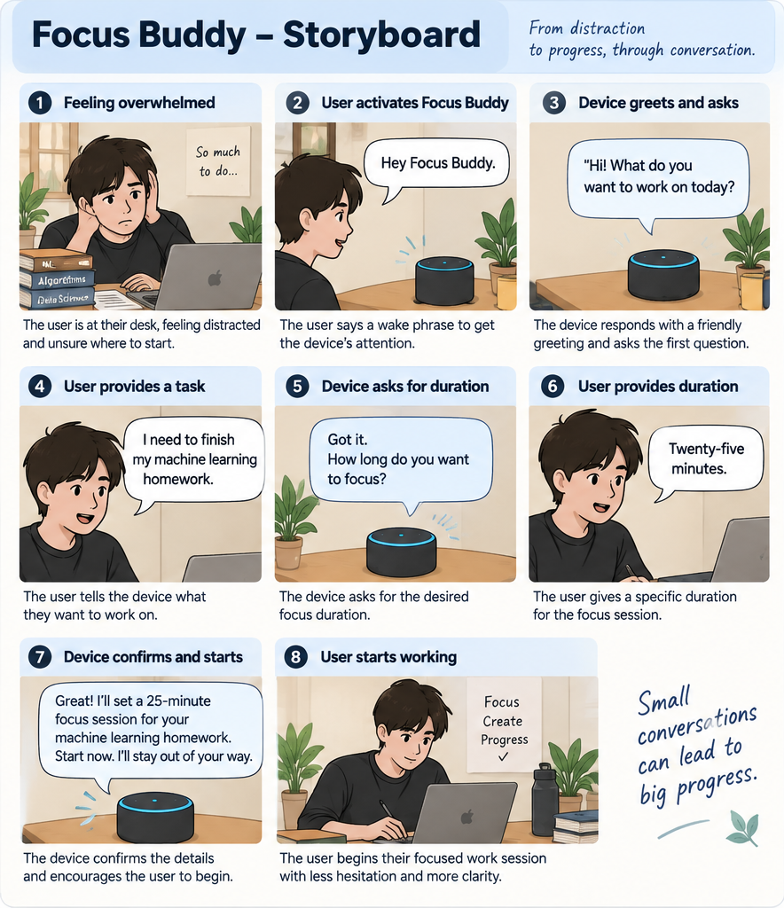
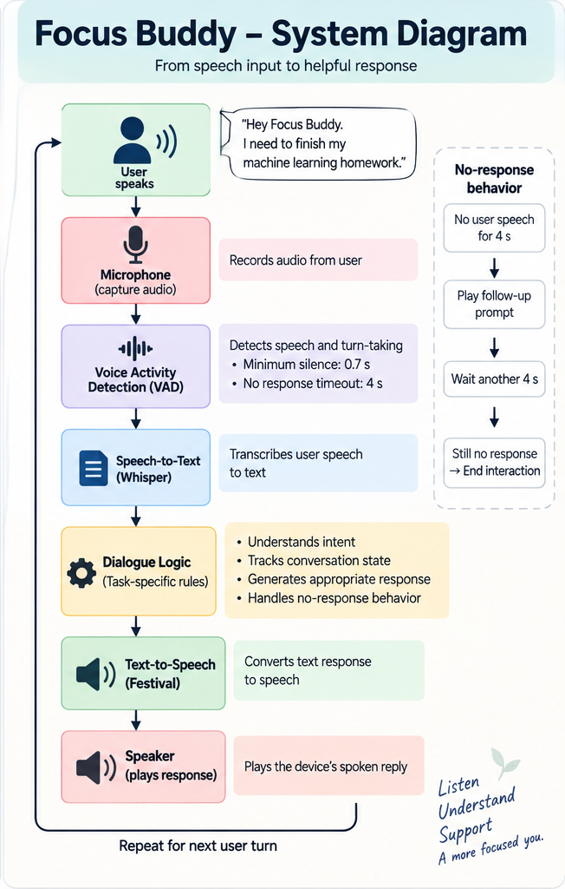
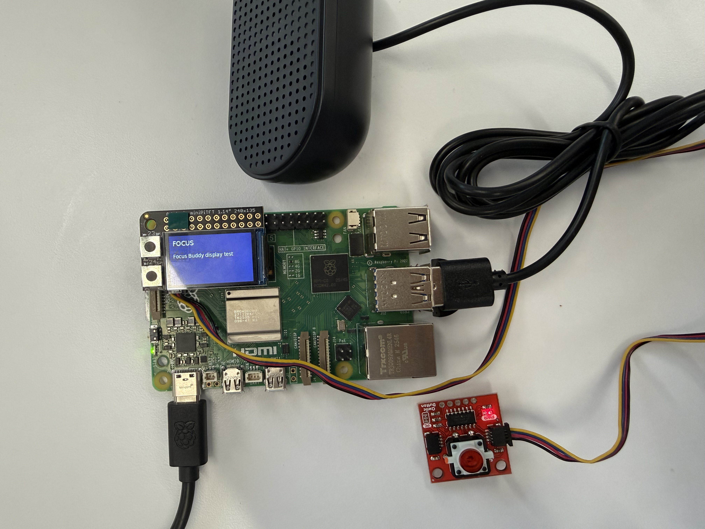
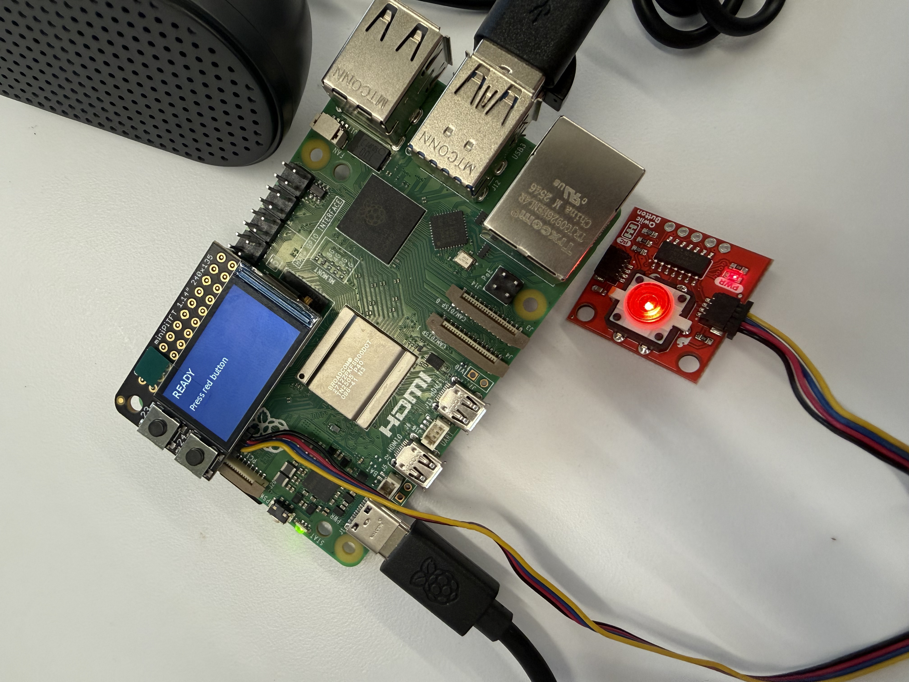
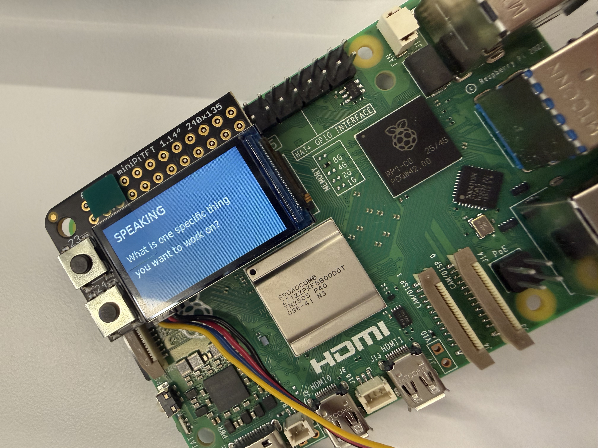
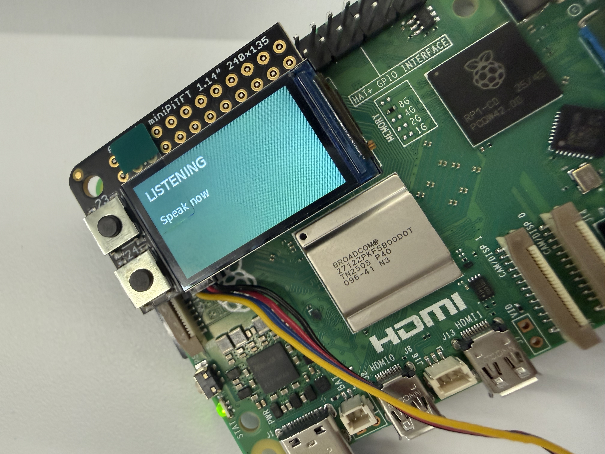
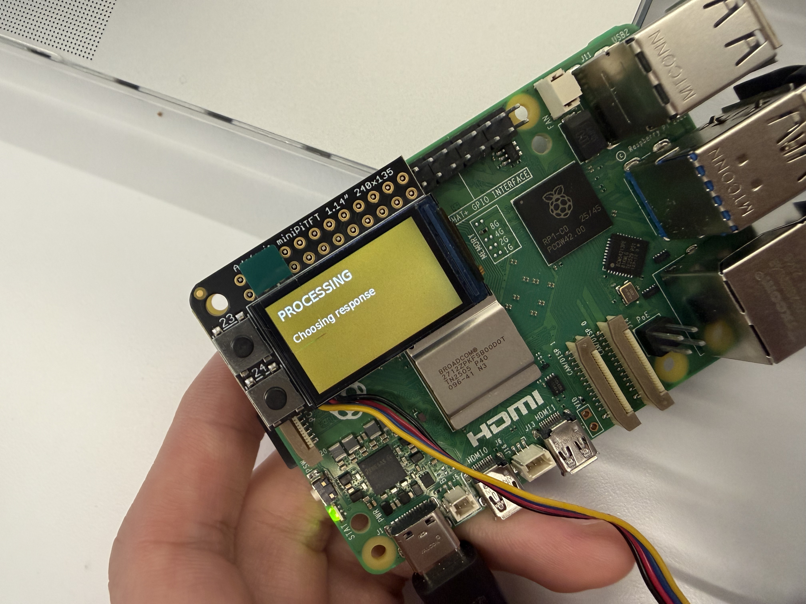
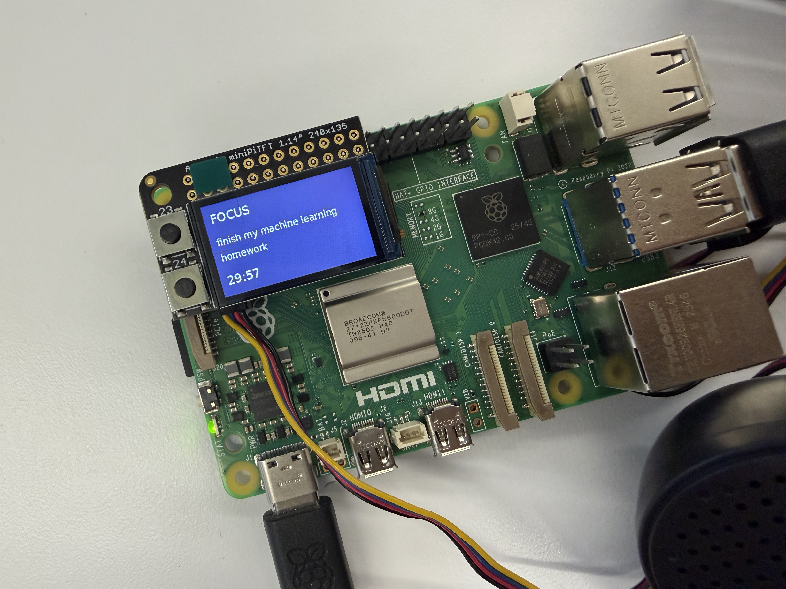
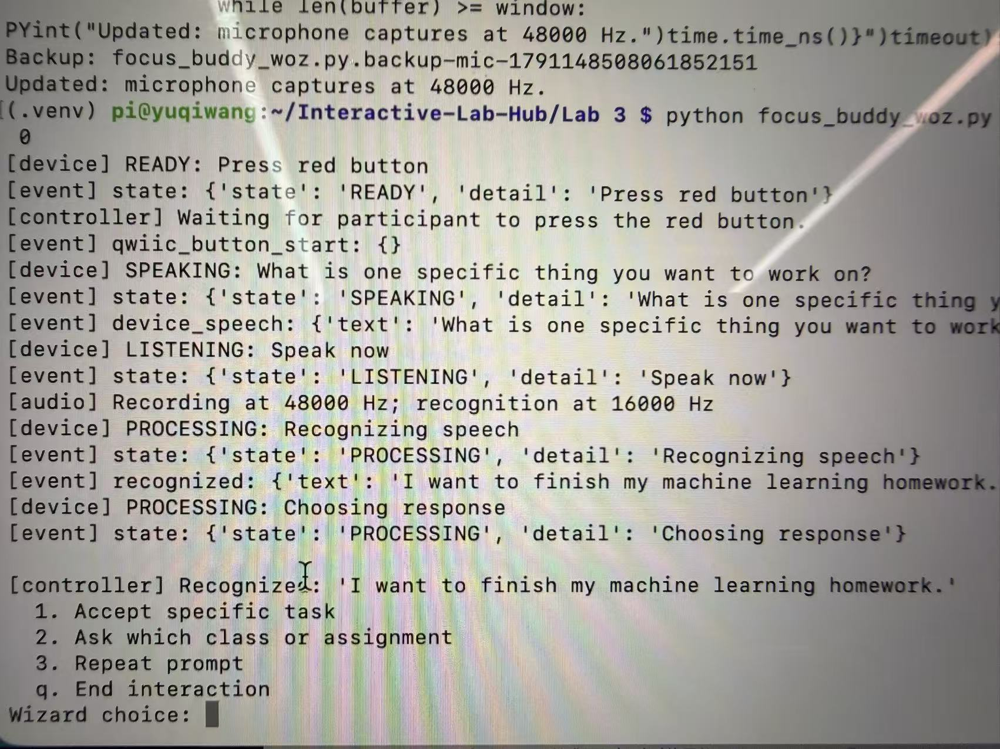

# Chatterboxes

Collaborator: Jerry Lee

In this lab, we want you to design interaction with a speech-enabled device — something that listens and talks to you. This device can do anything *but* control lights (since we already did that in Lab 1). First, we want you to storyboard what you imagine the conversational interaction to be like. Then you will use wizarding techniques to elicit examples of what people might say, ask, or respond. We then want you to use the examples collected from at least two other people to inform the redesign of the device.

We will focus on **audio** as the main modality for interaction to start; these general techniques can be extended to **video**, **haptics** or other interactive mechanisms in the second part of the Lab.

A note on what you are building with. Speech interfaces are usually taught as two boxes — speech-in, speech-out — and that framing hides the part that actually determines whether an interaction works. Between listening and speaking sits the question of **whose turn it is**: when does the device decide you have finished talking, and how long does it make you wait before it answers? This lab gives you direct control over both, and we will ask you to notice what changes when you move them.

# Part 1

## A. Text to Speech

\*\***Write your own shell file to use your favorite of these TTS engines to have your Pi greet you by name.**\*\*
(This shell file should be saved to your own repo for this lab.)

The same greeting did not feel exactly the same across the different voices. Festival sounded more human and friendly to me, while eSpeak sounded more robotic and mechanical. Even though the words were identical, the Festival voice made the greeting feel more like it was coming from a person rather than from a machine.

## B. Speech to Text
### Speech-to-Text Model Comparison

| Model | Audio Duration | Model Load | Transcription Time | Real-Time Factor | Transcription |
|---|---:|---:|---:|---:|---|
| `tiny.en` | 5.00 s | 1.64 s | 1.35 s | **0.27x** | Hello, my name is Dave and I'm testing speech recognition. |
| `base.en` | 5.00 s | 2.37 s | 2.29 s | **0.46x** | Hello my name is Dave and I'm testing speech recognition. |
| `small.en` | 5.00 s | 6.46 s | 6.17 s | **1.23x** | Hello, my name is Dave and I'm testing speech recognition. |

All three models produced essentially the same correct transcription, but their response times were very different. `tiny.en` was the fastest with a real-time factor of **0.27x**, while `base.en` increased to **0.46x** without a noticeable improvement in accuracy. `small.en` was much slower at **1.23x**, meaning that transcribing five seconds of audio took longer than the audio itself.

For a conversational system that needs to respond quickly, the additional delay of `small.en` is not worth it for this example because it did not provide any noticeable accuracy improvement. Based on this test, I would prefer `tiny.en` for responsiveness, or `base.en` if slightly more recognition capacity is needed while still keeping the latency reasonably low.

### Numerical Input Test

I wrote a script that verbally asks the user for their ZIP code using Festival, records the response for five seconds, and saves it as an audio file.

For my test, I answered:

`10044`

| Model | Transcription | Real-Time Factor | Result |
|---|---|---:|---|
| `tiny.en` | `1 0 0 4 4` | **0.18x** | Correct |
| `base.en` | `Go in 0044.` | **0.36x** | Incorrect |

The `tiny.en` model correctly recognized all five digits, although it formatted them as separate numbers. In contrast, `base.en` incorrectly interpreted the beginning of the ZIP code as words and produced “Go in 0044.”

This test showed that a larger speech-recognition model does not necessarily perform better on numerical input. Digit sequences can be ambiguous because the model may interpret similar sounds as words instead of individual numbers. For applications that require exact numerical input, such as ZIP codes or phone numbers, I would add confirmation or validation rather than relying on a single transcription.

## C. Turn-taking: knowing when someone has stopped talking
### Turn-Taking Threshold Comparison

| Minimum Silence | What It Felt Like |
|---|---|
| `0.2s` | The system responded very quickly, but it was too sensitive to short pauses. Normal hesitations, pauses between phrases, or taking a quick breath could be treated as the end of my turn, which caused one sentence to be split into multiple utterances. |
| `0.7s` | This felt the most natural. It allowed short pauses without interrupting me, while still responding quickly enough after I finished speaking. |
| `1.5s` | The system waited noticeably after I had already finished speaking. The delay made it feel slow and slightly uncertain, as if it was not sure whether I was done talking. |

At `0.2s`, normal conversational pauses such as hesitation, thinking briefly between phrases, or taking a breath were often cut off. At `1.5s`, the system felt less responsive because there was a noticeable delay before it reacted. For normal conversation, a middle value such as `0.7s` felt like a better balance between avoiding interruptions and responding quickly.

There is no correct value. A system that takes drink orders and a system that listens to someone think out loud want very different thresholds, and the right one depends on what your users are doing with their pauses.

## D. Storyboard

### Device Concept: Focus Buddy

Focus Buddy is a desktop voice assistant that helps users move from
feeling distracted or overwhelmed to beginning a focused work session.
Through a short conversation, it asks the user what they want to work
on and how long they want to focus.

### Storyboard

The storyboard shows the interaction from the user's perspective. The
user begins in a distracted state, activates Focus Buddy, identifies a
task, chooses a duration, and then begins working after the device
confirms the plan.

### System Diagram

The system diagram shows how the Raspberry Pi processes each user turn.
The microphone captures the user's speech, Voice Activity Detection
determines when the user has finished speaking, faster-whisper converts
the audio into text, the dialogue logic selects the next response,
Festival converts the response into speech, and the speaker plays it
back to the user.

### Imagined Dialogue

**User:**  
“Hey Focus Buddy.”

**Focus Buddy:**  
“Hi! What do you want to work on today?”

*Focus Buddy waits up to 4 seconds for the user to begin speaking.
After the user starts speaking, the system considers the turn complete
after 0.7 seconds of silence.*

**User:**  
“I need to finish my machine learning homework.”

**Focus Buddy:**  
“Got it. How long do you want to focus?”

*Focus Buddy again waits up to 4 seconds for the user to begin speaking
and uses 0.7 seconds of silence to determine when the user has finished.*

**User:**  
“Twenty-five minutes.”

**Focus Buddy:**  
“Twenty-five minutes on your machine learning homework. Ready to start?”

*Focus Buddy waits for confirmation.*

**User:**  
“Yes.”

**Focus Buddy:**  
“Great. Start now. I’ll stay out of your way.”

*The conversation ends, and the user begins working.*

### Process Description

I started by thinking about a situation where a voice interface would be more useful than a screen-based interaction. I wanted the device to support a simple task that could be completed through a short conversation, so I designed **Focus Buddy**, a desktop voice assistant that helps a user begin a focused work session.

The interaction is intentionally narrow. Instead of allowing an open-ended conversation, the device asks the user three questions: what they want to work on, how long they want to focus, and whether they are ready to begin. This keeps the interaction predictable and prevents the voice assistant itself from becoming another distraction.

I also designed the timing based on what I observed in Part C. A `0.2s` silence threshold often cut off normal pauses, while `1.5s` made the system feel noticeably slow. I therefore chose **0.7 seconds of silence** as the endpointing threshold. This gives the user enough time to pause briefly while thinking, but still allows the system to respond quickly after the user finishes speaking.

I also added a separate **4-second no-response timeout**. This is different from the 0.7-second endpointing threshold. The 0.7-second threshold determines when the system decides that the user has finished an utterance, while the 4-second timeout determines how long the device waits when the user has not started answering at all.

If the user does not respond within four seconds, the device gives one short follow-up prompt. If there is still no response after another four seconds, the interaction ends instead of repeatedly interrupting the user.

The main design goal was to make the conversation feel short, calm, and responsive. The device helps the user move from hesitation to a concrete task and time commitment, then stops talking so the user can begin working.

### Dialogue Script with Pauses

| Step | Speaker | Utterance / Action | Pause / Timing |
|---|---|---|---|
| 1 | User | “Focus Buddy.” | — |
| 2 | Device | “What do you want to work on?” | Wait for user speech |
| 3 | User | “I need to finish my machine learning homework.” | Device ends the turn after **0.7 s of silence** |
| 4 | Device | “Got it. How long do you want to focus?” | Wait for user speech |
| 5 | User | “Twenty-five minutes.” | Device ends the turn after **0.7 s of silence** |
| 6 | Device | “Twenty-five minutes on your machine learning homework. Ready to start?” | Wait for user speech |
| 7 | User | “Yes.” | Device ends the turn after **0.7 s of silence** |
| 8 | Device | “Great. Start now. I’ll stay out of your way.” | Conversation ends |

### No-response behavior

If the user does not begin answering within **4 seconds**, the device says:

> “Take your time. You can answer whenever you’re ready.”

The device then waits another **4 seconds**. If the user still does not respond, it ends the interaction and returns to its idle state.

### Timing Decisions

- **0.7 s endpointing threshold:** used to decide when the user has finished speaking.
- **4 s no-response timeout:** used when the user has not started speaking at all.
- The shorter threshold keeps the conversation responsive, while the longer timeout gives the user enough time to think before the device interrupts.

## E. Acting out the dialogue

https://github.com/user-attachments/assets/4c343ec8-a82f-4218-b551-ea6107e6b687

Find a partner, and *without sharing the script with your partner* try out the dialogue you've designed, where you (as the device designer) act as the device you are designing. Please record this interaction (for example, using Zoom's record feature).

The acted-out dialogue followed the same overall structure I had imagined: the device asked for a task, asked for a duration, and then confirmed whether the user was ready to begin. However, the real interaction was less clean and predictable than my scripted version.

The participant hesitated and repeated “I guess I want” before describing the task. The task itself was also less specific than the answer in my original dialogue. My original design assumed that the user would immediately provide one clear task, such as “I need to finish my machine learning homework.” In the acted interaction, Focus Buddy should probably have asked a clarification question, such as “What subject would you like to study?” Instead, I continued to the duration question, which caused the final confirmation to use the generic phrase “your task” rather than repeating a meaningful task name.

The duration question worked as expected because the participant gave a clear answer of thirty minutes. The final confirmation was also different from my imagined dialogue. Rather than simply saying “Yes,” the participant said, “Okay, please start.” This suggests that the system should recognize several natural forms of confirmation, including “yes,” “okay,” “sure,” and “please start.”

The participant answered every prompt, so the four-second no-response behavior was not triggered. Because I acted as the device manually, the 0.7-second endpointing threshold was approximated rather than measured by the system. Overall, the basic conversation flow worked, but the test showed that the redesigned version should better handle hesitation, repeated words, vague task descriptions, and different forms of confirmation.

---

# Lab 3 Part 2

## Prep for Part 2

In Part 1, the participant hesitated and described a vague task. Focus Buddy moved directly to the duration question, so its final confirmation could only say “your task.” I will change the first prompt to “What is one specific thing you want to work on?” If the answer is still vague, the device will ask one clarification question before asking for a duration.

The participant also said “Okay, please start” instead of a simple “yes.” The redesigned interaction will accept natural confirmations such as “yes,” “okay,” and “please start,” and will offer a way to correct the task or duration before starting.

I will keep the 0.7-second silence threshold because it felt more natural than 0.2 or 1.5 seconds in Part 1. The original four-second wait for someone to begin answering was not triggered in that test. I will try six seconds, give one gentle reminder, and observe whether this feels too short or too long in Part 2.

## Prototype your system

The system should:
* use the Raspberry Pi
* use one or more sensors
* require participants to speak to it

*Document how the system works.*

### How Focus Buddy works

Focus Buddy is a Wizard-of-Oz speech prototype running on a Raspberry Pi. The participant presses and releases a **SparkFun Qwiic Button** to begin, then speaks into a USB microphone. A hidden wizard operates the controller through an SSH terminal. The participant does not operate the controller.

1. **Ready to begin.** The Pi loads its speech models and checks the selected audio formats before displaying READY. The Qwiic Button's built-in LED pulses slowly. The participant presses and releases the red button to start.
2. **Speaking and listening.** Piper generates a spoken question asking for one specific task. The MiniPiTFT shows SPEAKING during playback and LISTENING once the microphone stream is open. The button's central LED stays on while listening.
3. **Speech processing.** The USB microphone captures audio at 48,000 Hz, which is continuously converted to 16,000 Hz for Silero VAD and faster-whisper. VAD ends a turn after 0.7 seconds of silence. The screen shows PROCESSING and the central LED pulses faster while the system transcribes the answer and waits for the wizard's next action.
4. **Wizard control.** The wizard reads the suggested transcript and selects a numbered action: accept or clarify the task, repeat a question, accept a duration, change the plan, or start the session. The wizard enters the final task wording and duration, so recognition errors can be corrected before the Pi repeats them. Natural confirmations such as “yes” or “please start” are interpreted by the wizard.
5. **Confirmation and focus.** Piper speaks the selected response through the USB speaker. Its audio is resampled to the speaker's supported 48,000 Hz rate. After the participant confirms the plan and the wizard selects Start, the screen shows the task and a separate countdown. The button LED is off during focus.

The microphone and Qwiic Button provide sensor inputs, and speaking is required to answer the device's prompts. Speech capture, transcription, playback, screen feedback, and LED control run on the Pi; a person makes the dialogue decisions.

### State feedback and timing

| State | MiniPiTFT | Qwiic Button central LED |
|---|---|---|
| BOOTING | Loading; please wait | Off |
| READY | Press red button | Slow pulse |
| SPEAKING | Device prompt | Off |
| LISTENING | Speak now | On |
| PROCESSING | Please wait | Faster pulse |
| FOCUS | Task and remaining time | Off |

The board's small PWR light is a power indicator; the programmable status light is inside the red button. The button communicates over I2C at address `0x6f`.

If a participant does not start answering within six seconds, the device gives one reminder and waits again. If there is still no answer, the interaction ends. A listening turn is capped at thirty seconds to prevent continuous noise from keeping it open indefinitely. Empty transcriptions also receive one retry. The wizard can end the interaction with `q` at a menu or Ctrl+C.

Each launch runs one interaction. On completion, cancellation, or error, the program releases its audio and display resources and turns off the central LED and display backlight. The wizard runs the command again for the next participant.

## Test the system

### What worked well about the system and what didn't?
During development testing, pressing the Qwiic Button successfully started the interaction. The screen progressed through SPEAKING and LISTENING, and the microphone captured speech that appeared as a suggested transcript in the controller. This demonstrated that the physical start control, screen feedback, and speech input could work together.

The main problems were hardware compatibility and reliability. The speaker initially rejected the generated audio’s sample rate, and the microphone also rejected the original recording configuration. Testing identified 48,000 Hz as a supported rate for both devices. Another run reached the duration-selection stage but stopped because the terminal could not display a special character. These failures showed that the complete interaction needs to be tested through confirmation and the focus timer, beyond checking individual components.

### What worked well about the controller and what didn't?
The numbered terminal menus presented relevant actions for each dialogue stage. The recognized transcript appeared directly above the menu, making it available when the wizard selected a response. The controller also provided fields for entering the final task and duration, allowing the wizard to correct or clarify the information before confirmation.

The main limitation was the amount of manual work required. The wizard had to read the transcript, choose an action, and sometimes enter additional text. These steps can introduce delays, although I have not measured their effect with participants. The terminal encoding error also interrupted the interaction at the duration prompt. Keeping the current task, duration, and recent dialogue visible together would make the controller easier to follow.

### What lessons can you take away from the WoZ interactions for designing a more autonomous version of the system?
The prototype separates speech recognition from dialogue decisions. Producing a transcript does not establish whether a task is specific enough, whether a duration is valid, or whether the person has confirmed the plan. An autonomous version would need explicit rules for these decisions, including clarification, correction, and confirmation.

Turn timing also needs participant testing. A fixed silence threshold may interpret a thinking pause as the end of an answer. A more flexible threshold and a clear way to repeat or extend an answer could improve recovery. The system should also handle different confirmation phrases, such as “yes” and “please start.” Wizard decisions could inform these rules, but they should be evaluated against participant feedback before being treated as correct examples.

### How could you use your system to create a dataset of interaction? What other sensing modalities would make sense to capture?
With participant consent, the existing JSONL logger could record timestamps, device states, prompts, recognized text, button activation, and wizard decisions. I would add anonymous participant and session IDs, task scenarios, observer notes, and whether the interaction reached a confirmed plan. Useful measurements would include the time from button press to focus-session start and the frequency of clarification or repetition.

The current logger does not save raw audio. Adding consented audio recording and manually verified transcripts would support analysis of speech-recognition errors. Verified transcripts should remain separate from the wizard’s edited task wording.

Additional sensing could include video showing how people use the screen and button, or a distance sensor detecting when someone approaches or leaves the desk. These signals could provide context for interruptions, but presence alone would not demonstrate attention or productivity.
